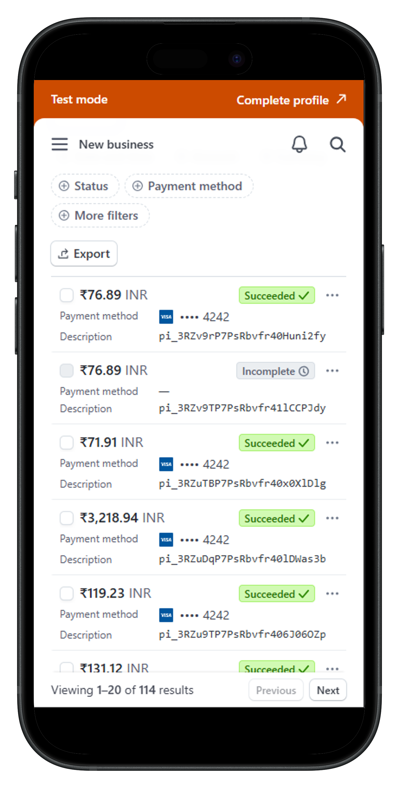

# 🛒 RahulMart – A Progressive Web App (PWA)

**RahulMart** is a simple and modern **eCommerce Progressive Web App (PWA)** made using **ReactJS**. It gives a smooth shopping experience with fast loading, offline support, and mobile-friendly design.

---

## 🚀 Features

- ✅ **Sort Products** – by price (high/low) or name (A-Z, Z-A)
- 🔍 **Filter Products** – by category, company, color, shipping, and price range
- 🛒 **Add to Cart** – smart and dynamic cart with item quantity control
- 🔐 **Google & Twitter Login** – using **Auth0**
- 💳 **Secure Payment** – with **Stripe SDK**
- 🌙 **Dark Mode** – easy on the eyes
- 🔎 **Search Modal** – find products quickly
- 📱 **Responsive Design** – works on phones, tablets, and desktops
- 📦 **PWA Enabled** – works offline and installable on your device
- 💾 **LocalStorage** – stores cart, auth, and product data even after refresh
- 🔗 **Airtable Integration** – fetch product data easily, so anyone can manage content (CRUD)
- 📧 **FormSpree Email** – to send messages from contact forms
- ☁️ **Serverless Functions** – handle backend tasks without a full server
- ⏳ **Skeleton Loaders** – show loading skeletons for most data components to improve user experience

---

## 🛠️ Tech Stack

- **Frontend:** ReactJS, React Router, Tailwind CSS
- **Backend:** Serverless functions
- **Database:** Airtable
- **Authentication:** Auth0
- **Payments:** Stripe
- **State Management:** Context API
- **PWA Support:** Service Workers, `manifest.json`

---

## 📦 Getting Started

1. **Clone the project**:

   ```bash
   git clone https://github.com/YOUR-USERNAME/rahulmart.git
   ```

2. **Go to the folder**:

   ```bash
   cd rahulmart
   ```

3. **Install dependencies**:

   ```bash
   npm install
   ```

4. **Start the development server**:

   ```bash
   npm start        # Only frontend
   ```

   or

   ```bash
   npm run netlify  # Frontend + Serverless functions
   ```

5. Visit [http://localhost:3000](http://localhost:3000) to see the app (for npm start)
6. Visit [http://localhost:8888](http://localhost:88880 to see the app (for npm run netlify)
7. If facing typescript version issue toggle between TS@^5.0.0 and TS@4.9.5

---

## ⚙️ Build for Production

To create a build for deployment:

```bash
npm run build
```

This will create an optimized `build` folder you can host on **Netlify**, **Vercel**, or any static hosting platform.

---

## 🖼️ Project Screenshots

### 📱 Phone View

|  |  |  |  |  |
| ------------------------------------------------------------------ | -------------------------------------------------- | ------------------------------------------------------- | ---------------------------------------------------------- | ------------------------------------------------------ |

### 💻 PC View

|  |  |  |  |  |
| ------------------------------------------------ | ------------------------------------------------ | ----------------------------------------------------------- | -------------------------------------------------------- | ---------------------------------------------------------- |

## 🧪 Required Environment Variables

Make sure to create a \`.env\` file in the root directory and add the following variables with your own values:

AIRTABLE_API_TOKEN=your_airtable_api_token
AIRTABLE_BASE_ID=your_airtable_base_id

REACT_APP_WEBSITE_URL=your_website_url

REACT_APP_AUTH_CLIENTID=your_auth0_client_id
REACT_APP_AUTH_SECRETKEY=your_auth0_domain

REACT_APP_STRIPE_PUBLISH_KEY=your_stripe_publishable_key
REACT_APP_STRIPE_SECRETKEY=your_stripe_secret_key

> ⚠️ Do **not** commit this \`.env\` file to version control. Keep your credentials secure.
